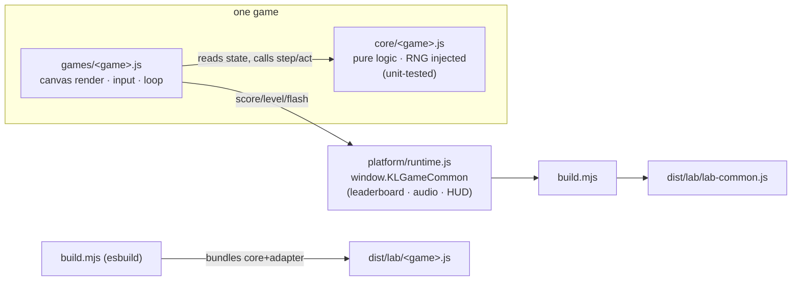
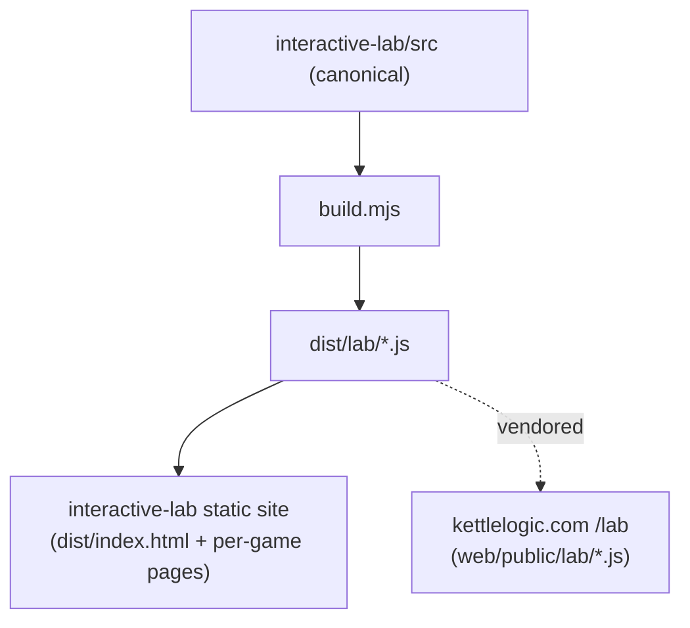

# Architecture

Each game is split into a **pure logic core** and a **browser adapter**, so the
rules are deterministic and unit-tested while the DOM/canvas code stays thin.

## Why the split

- **`src/core/*`** holds the rules — board/pieces/collision (Kettletris), task
  queue + overflow (Backlog), physics + obstacles (SteamRunner). No DOM, no
  canvas, no timers; randomness is injected. This is what the unit tests drive.
- **`src/games/*`** is the adapter: it reads core state to render the (premium)
  canvas, maps keyboard/pointer/custom events to core calls, and runs the
  `requestAnimationFrame` loop.
- **`src/platform/runtime.js`** is the shared browser runtime exposed as
  `window.KLGameCommon` — localStorage leaderboard, audio, and HUD bindings.
  Identical contract on both the standalone site and kettlelogic.com's lab shell.

## One source of truth, two shells

The build emits the exact files both shells load — `lab-common.js` (defines
`window.KLGameCommon`) and a self-running `<game>.js` per game — against a shared
DOM contract (`#game-canvas`, `#game-score`, `#game-level`, `#game-status`,
`#game-start-btn`, `#game-leaderboard`, `#score-form`).

The kettlelogic site **vendors** the built bundles into `web/public/lab/` rather
than keeping its own forked copies — eliminating the drift that previously left
the standalone games behind the site's.

## Tooling

- **esbuild** — bundles ESM source into browser IIFE files (no runtime deps).
- **Vitest** — unit tests on `src/core` with a coverage gate (90% lines, 85% branches).
- **ESLint** — flat config, browser globals for adapters, node globals for core/tests.
- **Docker** — multi-stage build → unprivileged nginx (non-root, healthcheck).
- **Kubernetes** — `deploy/k8s/`: 2 replicas, readiness/liveness probes, resource
  bounds, non-root + read-only root FS, ClusterIP.
